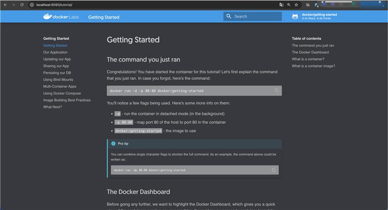
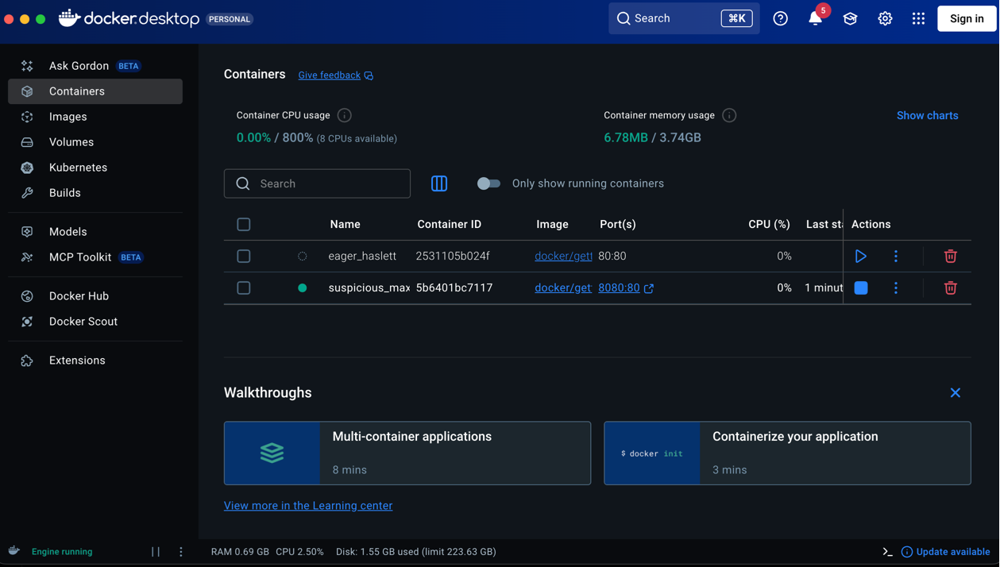
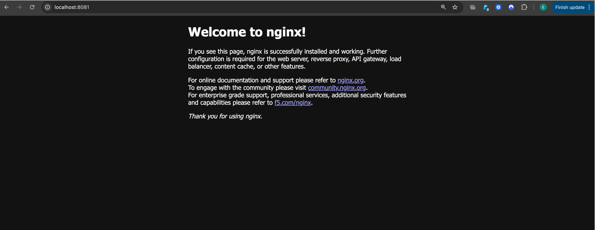
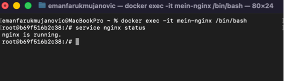
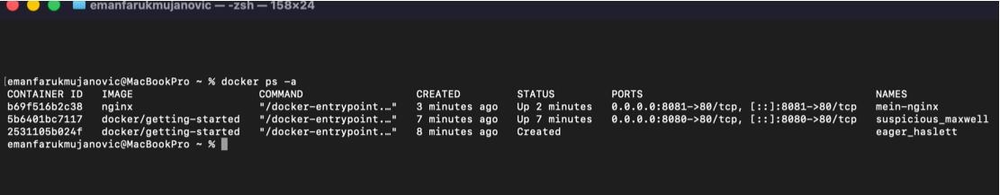
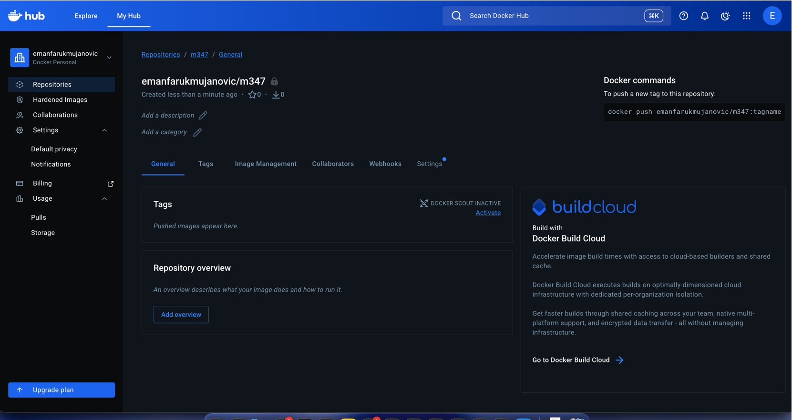
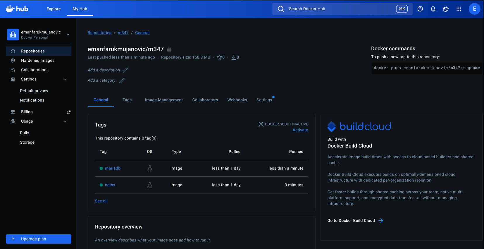

# KN01 – Docker Grundlagen

# A) Installation

## Erster Container

```bash
docker run -d -p 8080:80 docker/getting-started
```

Browser:

```text
http://localhost:8080
```

### Screenshots



Docker Getting Started Webseite mit sichtbarer URL.

---



Docker Desktop mit laufendem Container.

---

# B) Docker CLI

## Docker-Version prüfen

```bash
docker --version
```

---

## Docker Images suchen

```bash
docker search ubuntu
```

```bash
docker search nginx
```

---

## Erklärung docker run

```bash
docker run -d -p 8080:80 docker/getting-started
```

| Parameter | Bedeutung |
|---|---|
| docker run | Startet Container |
| -d | Hintergrundmodus |
| -p 8080:80 | Portweiterleitung |
| docker/getting-started | Docker Image |

---

# nginx Image

## Image herunterladen

```bash
docker pull nginx
```

---

## Container erstellen

```bash
docker create -p 8081:80 --name mein-nginx nginx
```

---

## Container starten

```bash
docker start mein-nginx
```

Browser:

```text
http://localhost:8081
```

### Screenshot



nginx Standardseite mit sichtbarer URL.

---

# Ubuntu Image

## Ubuntu mit -d

```bash
docker run -d ubuntu
```

### Erklärung

Das Ubuntu-Image wurde automatisch heruntergeladen. Der Container wurde jedoch direkt beendet, da kein aktiver Prozess läuft.

---

## Ubuntu mit -it

```bash
docker run -it ubuntu
```

### Erklärung

Mit `-it` wurde eine interaktive Shell geöffnet. Der Container blieb aktiv, solange die Shell geöffnet war.

---

# Shell im nginx Container

## Shell öffnen

```bash
docker exec -it mein-nginx /bin/bash
```

## nginx Status prüfen

```bash
service nginx status
```

## Shell verlassen

```bash
exit
```

### Screenshot



Ausgabe von `service nginx status`.

---

# Container anzeigen

```bash
docker ps -a
```

### Screenshot



Ausgabe von `docker ps -a`.

---

# Container stoppen

```bash
docker stop mein-nginx
```

---

# Container löschen

```bash
docker rm $(docker ps -aq)
```

---

# Images löschen

```bash
docker rmi nginx
```

```bash
docker rmi ubuntu
```

```bash
docker rmi docker/getting-started
```

---

# C) Registry und Repository

## Docker Hub Repository

Repository:

```text
BENUTZERNAME/m347
```

### Screenshot



Leeres privates Repository auf Docker Hub.

---

# D) Privates Repository

## nginx herunterladen

```bash
docker pull nginx
```

---

## Tag erstellen

```bash
docker tag nginx:latest BENUTZERNAME/m347:nginx
```

### Erklärung

Der Befehl erstellt einen zusätzlichen Namen für das Image.

---

## Image hochladen

```bash
docker push BENUTZERNAME/m347:nginx
```

### Erklärung

Das Image wird in Docker Hub hochgeladen.

---

# MariaDB

## Herunterladen

```bash
docker pull mariadb
```

---

## Tag erstellen

```bash
docker tag mariadb:latest BENUTZERNAME/m347:mariadb
```

---

## Hochladen

```bash
docker push BENUTZERNAME/m347:mariadb
```

---

### Screenshot



Docker Hub Repository mit den Tags `nginx` und `mariadb`.

---

# Verwendete Befehle

```bash
docker --version

docker search ubuntu
docker search nginx

docker run -d -p 8080:80 docker/getting-started

docker pull nginx

docker create -p 8081:80 --name mein-nginx nginx

docker start mein-nginx

docker run -d ubuntu

docker run -it ubuntu

docker exec -it mein-nginx /bin/bash

service nginx status

docker ps -a

docker stop mein-nginx

docker rm $(docker ps -aq)

docker images

docker rmi nginx
docker rmi ubuntu
docker rmi docker/getting-started

docker login

docker tag nginx:latest BENUTZERNAME/m347:nginx

docker push BENUTZERNAME/m347:nginx

docker pull mariadb

docker tag mariadb:latest BENUTZERNAME/m347:mariadb

docker push BENUTZERNAME/m347:mariadb
```