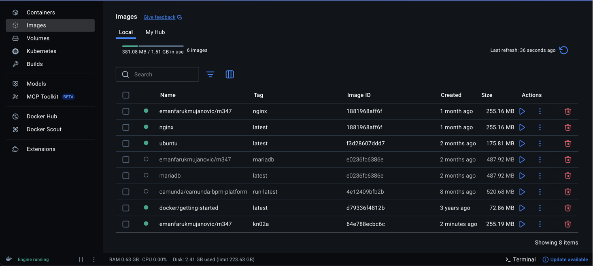
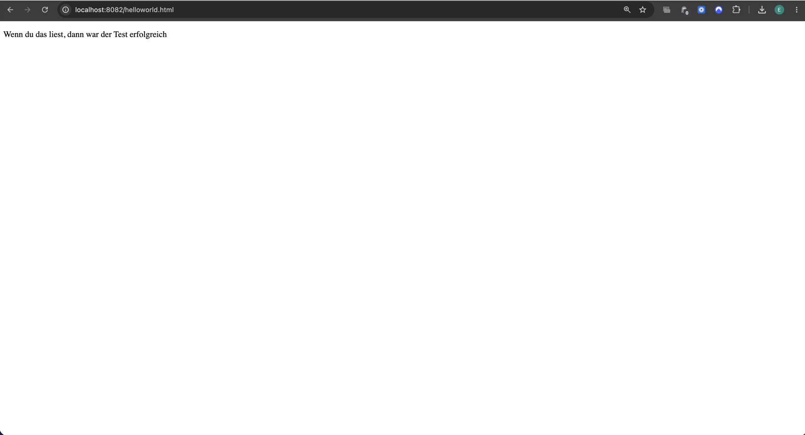

# KN02 – Dockerfile I

## Dokumentation Dockerfile

### Verwendetes Dockerfile

```dockerfile
FROM nginx

WORKDIR /usr/share/nginx/html

COPY helloworld.html .

EXPOSE 80
```

### Erklärung der einzelnen Zeilen

| Anweisung | Erklärung |
|------------|------------|
| FROM nginx | Verwendet das offizielle nginx-Image als Basis für das neue Image. |
| WORKDIR /usr/share/nginx/html | Setzt das Arbeitsverzeichnis auf den Ordner, in dem nginx seine Webseiten speichert. |
| COPY helloworld.html . | Kopiert die Datei helloworld.html in das aktuelle Arbeitsverzeichnis des Images. |
| EXPOSE 80 | Dokumentiert, dass der Container den Port 80 für HTTP verwendet. |

---

# Build des Images

## Befehl

```bash
docker build -t emanfarukmujanovic/m347:kn02a .
```

### Erklärung

| Parameter | Bedeutung |
|------------|------------|
| docker build | Erstellt ein neues Docker-Image |
| -t | Vergibt einen Namen und Tag |
| emanfarukmujanovic/m347:kn02a | Name des Images im Docker Hub Repository |
| . | Aktueller Ordner mit Dockerfile und HTML-Datei |

---

# Image in Docker Desktop

Das Image wurde erfolgreich erstellt und erscheint in Docker Desktop.



*Abbildung A1: Docker Desktop mit dem Image kn02a.*

---

# Container starten

## Befehl

```bash
docker run -d -p 8082:80 --name kn02a emanfarukmujanovic/m347:kn02a
```

### Erklärung

| Parameter | Bedeutung |
|------------|------------|
| docker run | Erstellt und startet einen Container |
| -d | Führt den Container im Hintergrund aus |
| -p 8082:80 | Verbindet Port 8082 des Hosts mit Port 80 des Containers |
| --name kn02a | Vergibt dem Container den Namen kn02a |
| emanfarukmujanovic/m347:kn02a | Verwendetes Docker-Image |

---

# Aufruf der Webseite

Nach dem Start des Containers wurde die folgende URL aufgerufen:

```text
http://localhost:8082/helloworld.html
```

Die HTML-Seite wurde erfolgreich angezeigt.



*Abbildung A2: Anzeige der Datei helloworld.html im Browser.*

---

# Push in das private Repository

## Befehl

```bash
docker push emanfarukmujanovic/m347:kn02a
```

### Erklärung

Der Befehl lädt das lokal erstellte Image in das private Docker Hub Repository hoch.

---

# Verwendete Befehle

```bash
docker build -t emanfarukmujanovic/m347:kn02a .

docker run -d -p 8082:80 --name kn02a emanfarukmujanovic/m347:kn02a

docker push emanfarukmujanovic/m347:kn02a
```