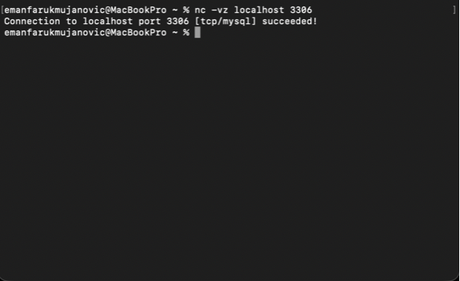
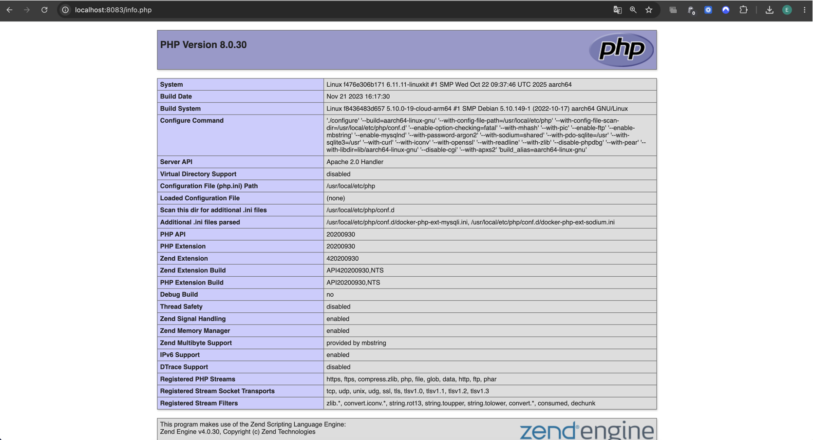
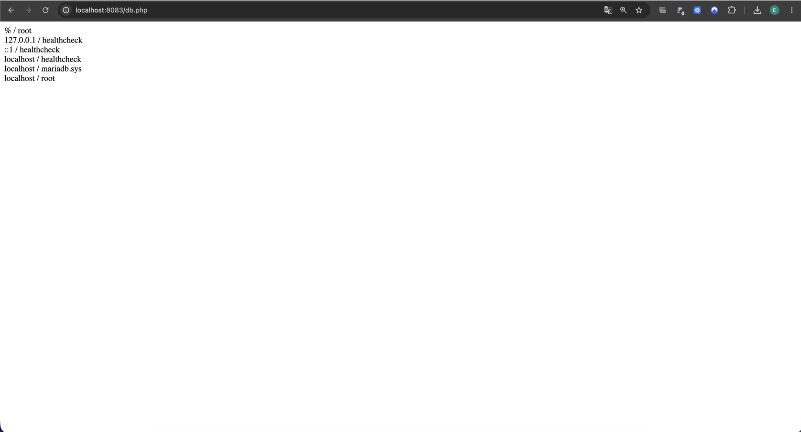

# KN02 – Dockerfile II

# Datenbank-Container (MariaDB)

## Dockerfile

```dockerfile
FROM mariadb

ENV MYSQL_ROOT_PASSWORD=secret123

EXPOSE 3306
```

## Erklärung

| Anweisung | Erklärung |
|------------|------------|
| FROM mariadb | Verwendet das offizielle MariaDB-Image als Basis. |
| ENV MYSQL_ROOT_PASSWORD=secret123 | Setzt das Passwort des root-Benutzers. |
| EXPOSE 3306 | Dokumentiert den Standard-Port von MariaDB. |

---

# Image erstellen

## Befehl

```bash
docker build -t emanfarukmujanovic/m347:kn02b-db .
```

---

# Container starten

## Befehl

```bash
docker run -d -p 3306:3306 --name kn02b-db emanfarukmujanovic/m347:kn02b-db
```

---

# Verbindung testen

## Befehl

```bash
nc -vz localhost 3306
```

Ausgabe zeigt, dass der Datenbankserver erreichbar ist.

---

## Screenshot



*Abbildung B1: Erfolgreiche Verbindung zum MariaDB-Server.*

---

# PHP-Webserver

## Verwendete Dateien

### info.php

```php
<?php
phpinfo();
?>
```

---

### db.php

```php
<?php

$servername = "172.xx.xx.xx";
$username = "root";
$password = "secret123";
$dbname = "mysql";

$conn = new mysqli($servername, $username, $password, $dbname);

if ($conn->connect_error) {
    die("Connection failed: " . $conn->connect_error);
}

$sql = "select Host, User from mysql.user;";
$result = $conn->query($sql);

while($row = $result->fetch_assoc()){
    echo($row["Host"] . " / " . $row["User"] . "<br />");
}

?>
```

---

# Dockerfile Webserver

```dockerfile
FROM php:8.0-apache

WORKDIR /var/www/html

COPY info.php .
COPY db.php .

RUN docker-php-ext-install mysqli

EXPOSE 80
```

## Erklärung

| Anweisung | Erklärung |
|------------|------------|
| FROM php:8.0-apache | Verwendet PHP 8 mit Apache-Webserver. |
| WORKDIR /var/www/html | Setzt den Webserver-Ordner. |
| COPY info.php . | Kopiert die Datei info.php in den Webserver-Ordner. |
| COPY db.php . | Kopiert die Datei db.php in den Webserver-Ordner. |
| RUN docker-php-ext-install mysqli | Installiert die MySQL-Erweiterung für PHP. |
| EXPOSE 80 | Dokumentiert den HTTP-Port des Webservers. |

---

# Image erstellen

## Befehl

```bash
docker build -t emanfarukmujanovic/m347:kn02b-web .
```

---

# Container starten

## Befehl

```bash
docker run -d -p 8083:80 --name kn02b-web emanfarukmujanovic/m347:kn02b-web
```

---

# Datenbank-IP ermitteln

## Befehl

```bash
docker inspect kn02b-db
```

Die ermittelte IP-Adresse wurde in der Datei db.php eingetragen.

---

# info.php testen

URL:

```text
http://localhost:8083/info.php
```

---

## Screenshot



*Abbildung B2: Ausgabe der PHP-Informationen über info.php.*

---

# db.php testen

URL:

```text
http://localhost:8083/db.php
```

---

## Screenshot



*Abbildung B3: Erfolgreiche Verbindung zur MariaDB-Datenbank über db.php.*

---

# Images in Docker Hub publizieren

## Datenbank-Image

```bash
docker push emanfarukmujanovic/m347:kn02b-db
```

---

## Webserver-Image

```bash
docker push emanfarukmujanovic/m347:kn02b-web
```

---

# Verwendete Befehle

```bash
# Datenbank

docker build -t emanfarukmujanovic/m347:kn02b-db .

docker run -d -p 3306:3306 --name kn02b-db emanfarukmujanovic/m347:kn02b-db

nc -vz localhost 3306

docker inspect kn02b-db

docker push emanfarukmujanovic/m347:kn02b-db


# Webserver

docker build -t emanfarukmujanovic/m347:kn02b-web .

docker run -d -p 8083:80 --name kn02b-web emanfarukmujanovic/m347:kn02b-web

docker push emanfarukmujanovic/m347:kn02b-web
```