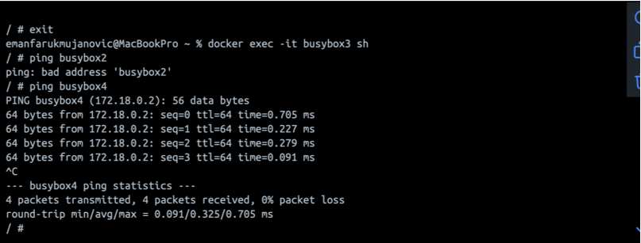
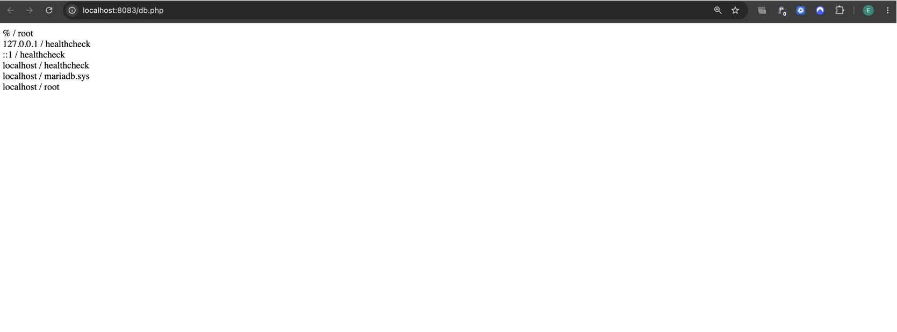

# KN03 – Netzwerk und Sicherheit

## Ziel

In diesem Auftrag wurden die Unterschiede zwischen dem Standard-Docker-Netzwerk (`bridge`) und einem benutzerdefinierten Netzwerk (`tbz`) untersucht. Zusätzlich wurde die Lösung aus KN02 verbessert, indem die Datenbank nicht mehr über eine feste IP-Adresse, sondern über den Containernamen angesprochen wird.

---

# Netzwerk erstellen

## Befehl

```bash
docker network create --subnet=172.18.0.0/16 tbz
```

### Erklärung

Erstellt ein eigenes Docker-Netzwerk mit dem Namen `tbz` und dem IP-Bereich `172.18.0.0/16`.

### Screenshot


---

# Container erstellen

## busybox1

```bash
docker run -dit --name busybox1 busybox
```

## busybox2

```bash
docker run -dit --name busybox2 busybox
```

## busybox3

```bash
docker run -dit --network tbz --name busybox3 busybox
```

## busybox4

```bash
docker run -dit --network tbz --name busybox4 busybox
```

### Screenshot


---

# IP-Adressen der Container

Die IP-Adressen wurden mit folgendem Befehl ermittelt:

```bash
docker inspect busybox1
docker inspect busybox2
docker inspect busybox3
docker inspect busybox4
```

### Screenshots


---

# Netzwerkkonfiguration busybox1

## Befehl

```bash
docker exec -it busybox1 sh
```

```bash
ifconfig
```

### Screenshot


---

# Gateway busybox1

## Befehl

```bash
route -n
```

### Screenshot


---

# Ping-Tests von busybox1

## Befehle

```bash
ping busybox2
ping <IP-von-busybox2>

ping busybox3
ping <IP-von-busybox3>
```

### Beobachtung

- busybox2 war erreichbar.
- busybox3 war nicht erreichbar.

### Screenshot


---

# Ping-Tests von busybox3

## Befehle

```bash
docker exec -it busybox3 sh

ping busybox4
ping <IP-von-busybox4>

ping busybox1
ping <IP-von-busybox1>
```

### Beobachtung

- busybox4 war erreichbar.
- busybox1 war nicht erreichbar.

### Screenshot


---

# Ping Tests über Namen


### Erklärung

`busybox1` und `busybox2` befinden sich im Standardnetzwerk `bridge`. Dort funktioniert die Kommunikation über Containernamen standardmässig nicht. `busybox3` und `busybox4` befinden sich hingegen im benutzerdefinierten Netzwerk `tbz`, in dem Docker eine automatische Namensauflösung bereitstellt. Deshalb funktioniert `ping busybox4`, während `ping busybox2` über den Containernamen nicht funktioniert.


# Gemeinsamkeiten und Unterschiede

## Gemeinsamkeiten

- Alle Container besitzen eine eigene IP-Adresse.
- Alle Container besitzen ein Gateway.
- Container im gleichen Netzwerk können miteinander kommunizieren.

## Unterschiede

- busybox1 und busybox2 befinden sich im Standardnetzwerk `bridge`.
- busybox3 und busybox4 befinden sich im Netzwerk `tbz`.
- Container in unterschiedlichen Netzwerken können sich nicht direkt erreichen.

## Schlussfolgerung

Docker trennt Netzwerke voneinander. Container können standardmässig nur mit Containern kommunizieren, die sich im gleichen Docker-Netzwerk befinden.

---

# Bezug zu KN02

## In welchem Netzwerk befanden sich der Web- und der DB-Container?

Die Container `kn02b-web` und `kn02b-db` befanden sich im selben Docker-Netzwerk und konnten deshalb miteinander kommunizieren.

---

## Weshalb funktionierte die Verbindung über die IP-Adresse des DB-Containers?

Da sich beide Container im gleichen Netzwerk befanden, konnte der Web-Container den Datenbank-Container direkt über dessen IP-Adresse erreichen.

---

## Weshalb ist diese Lösung nicht ideal?

Die IP-Adresse eines Containers kann sich ändern, wenn der Container gelöscht und neu erstellt wird. Dadurch würde die Verbindung zur Datenbank nicht mehr funktionieren.

---

# Verbesserungsvorschlag

Statt einer festen IP-Adresse wird ein eigenes Docker-Netzwerk verwendet. Die Verbindung erfolgt über den Containernamen.

## Netzwerk erstellen

```bash
docker network create kn02-net
```

---

## Datenbankcontainer starten

```bash
docker run -d --network kn02-net -p 3306:3306 --name kn02b-db emanfarukmujanovic/m347:kn02b-db
```

---

## Webcontainer starten

```bash
docker run -d --network kn02-net -p 8083:80 --name kn02b-web emanfarukmujanovic/m347:kn02b-web
```

---

## Anpassung in db.php

### Vorher

```php
$servername = "172.19.0.2";
```

### Nachher

```php
$servername = "kn02b-db";
```

---

## Warum funktioniert das?

Docker besitzt einen integrierten DNS-Dienst. Container innerhalb desselben Netzwerks können sich gegenseitig über ihren Namen erreichen.

Dadurch bleibt die Verbindung bestehen, auch wenn sich die IP-Adresse des Datenbank-Containers ändert.

---

# Test der Verbesserung

Nach der Umstellung wurde die Seite `db.php` erneut aufgerufen:

```text
http://localhost:8083/db.php
```

Die Verbindung zur Datenbank funktionierte weiterhin erfolgreich.

### Screenshot



---

# Verwendete Befehle

```bash
docker network create --subnet=172.18.0.0/16 tbz

docker network ls

docker run -dit --name busybox1 busybox
docker run -dit --name busybox2 busybox

docker run -dit --network tbz --name busybox3 busybox
docker run -dit --network tbz --name busybox4 busybox

docker ps

docker inspect busybox1
docker inspect busybox2
docker inspect busybox3
docker inspect busybox4

docker exec -it busybox1 sh
docker exec -it busybox3 sh

ifconfig

route -n

ping busybox2
ping busybox3
ping busybox4
ping busybox1

docker network create kn02-net

docker run -d --network kn02-net -p 3306:3306 --name kn02b-db emanfarukmujanovic/m347:kn02b-db

docker run -d --network kn02-net -p 8083:80 --name kn02b-web emanfarukmujanovic/m347:kn02b-web
```