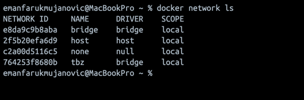
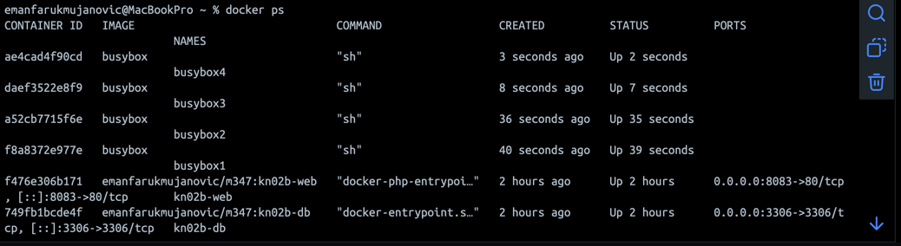
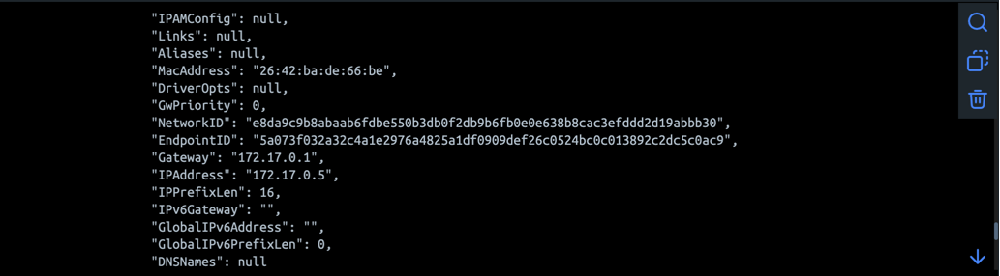
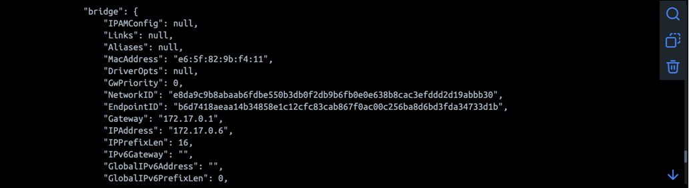
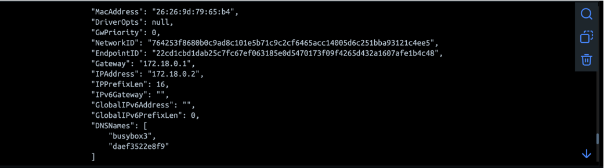
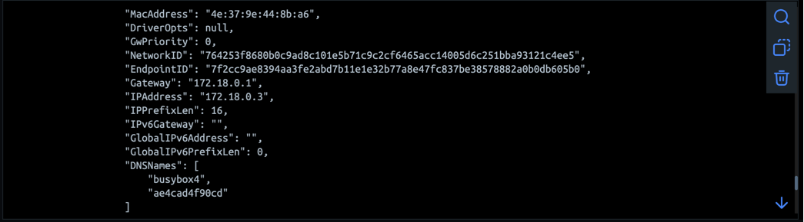
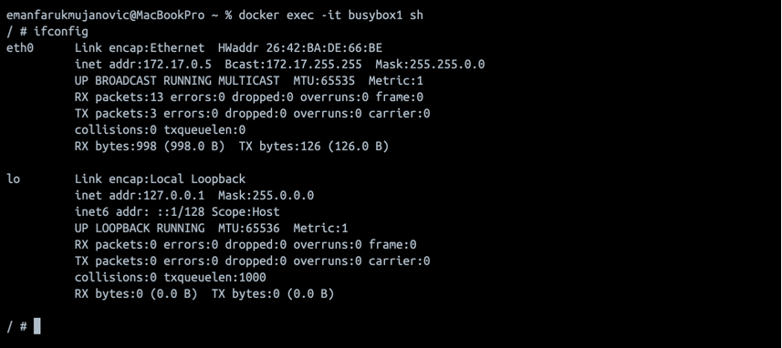
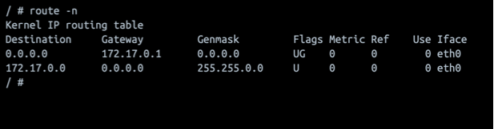
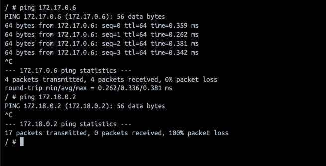
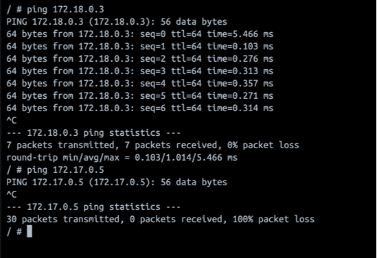

# KN03 – Netzwerk und Sicherheit

## Ziel

In diesem Auftrag wurden die Unterschiede zwischen dem Standard-Docker-Netzwerk (`bridge`) und einem benutzerdefinierten Netzwerk (`tbz`) untersucht.

---

# Netzwerk erstellen

## Befehl

```bash
docker network create --subnet=172.18.0.0/16 tbz
```

### Screenshot



*Abbildung A1: Erstelltes Docker-Netzwerk tbz.*

---

# Container erstellen

Folgende Container wurden erstellt:

- busybox1
- busybox2
- busybox3
- busybox4

busybox1 und busybox2 befinden sich im Standardnetzwerk `bridge`.

busybox3 und busybox4 befinden sich im Netzwerk `tbz`.

### Screenshot



*Abbildung A2: Laufende BusyBox-Container.*

---

# IP-Adressen der Container

## busybox1



*Abbildung A3: IP-Adresse von busybox1.*

---

## busybox2



*Abbildung A4: IP-Adresse von busybox2.*

---

## busybox3



*Abbildung A5: IP-Adresse von busybox3.*

---

## busybox4



*Abbildung A6: IP-Adresse von busybox4.*

---

# Netzwerkkonfiguration busybox1

## ifconfig



*Abbildung A7: Netzwerkkonfiguration von busybox1.*

---

## Gateway



*Abbildung A8: Default Gateway von busybox1.*

---

# Ping-Tests

## Tests von busybox1

Durchgeführt wurden folgende Befehle:

```bash
ping busybox2
ping <IP-von-busybox2>

ping busybox3
ping <IP-von-busybox3>
```

### Beobachtung

- busybox2 war erreichbar.
- busybox3 war nicht erreichbar.

### Screenshot



*Abbildung A9: Ping-Tests von busybox1.*

---

## Tests von busybox3

Durchgeführt wurden folgende Befehle:

```bash
ping busybox4
ping <IP-von-busybox4>

ping busybox1
ping <IP-von-busybox1>
```

### Beobachtung

- busybox4 war erreichbar.
- busybox1 war nicht erreichbar.

### Screenshot



*Abbildung A10: Ping-Tests von busybox3.*

---

# Gemeinsamkeiten und Unterschiede

## Gemeinsamkeiten

- Alle Container besitzen eine eigene IP-Adresse.
- Alle Container besitzen ein Default Gateway.
- Container im gleichen Netzwerk können miteinander kommunizieren.

## Unterschiede

- busybox1 und busybox2 befinden sich im Standardnetzwerk `bridge`.
- busybox3 und busybox4 befinden sich im benutzerdefinierten Netzwerk `tbz`.
- Container aus unterschiedlichen Netzwerken können sich nicht direkt erreichen.

## Schlussfolgerung

Docker trennt Netzwerke voneinander. Container können standardmässig nur mit Containern kommunizieren, die sich im gleichen Docker-Netzwerk befinden.

---

# Bezug zu KN02

## In welchem Netzwerk befanden sich Web- und DB-Container?

Die Container `kn02b-web` und `kn02b-db` befanden sich im Standardnetzwerk `bridge`.

---

## Weshalb funktionierte die Verbindung über die IP-Adresse des DB-Containers?

Die Verbindung funktionierte, weil sich beide Container im selben Docker-Netzwerk befanden und sich dadurch gegenseitig erreichen konnten.

---

## Weshalb ist die Verwendung einer Container-IP nicht ideal?

Die IP-Adresse eines Containers kann sich ändern, wenn der Container gelöscht und neu erstellt wird. Dadurch würde die Verbindung nicht mehr funktionieren.

---

## Verbesserungsvorschlag

Ein eigenes Docker-Netzwerk verwenden und statt der IP-Adresse den Containernamen benutzen.

Beispiel:

```php
$servername = "kn02b-db";
```

anstatt:

```php
$servername = "172.xx.xx.xx";
```

Docker besitzt einen integrierten DNS-Dienst und kann Containernamen automatisch auflösen.

---

## Verwendete Befehle

```bash
docker network create --subnet=172.18.0.0/16 tbz

docker network ls

docker run -dit --name busybox1 busybox
docker run -dit --name busybox2 busybox

docker run -dit --network tbz --name busybox3 busybox
docker run -dit --network tbz --name busybox4 busybox

docker ps

docker inspect busybox1
docker inspect busybox2
docker inspect busybox3
docker inspect busybox4

docker exec -it busybox1 sh
ifconfig
route -n

docker exec -it busybox3 sh
ifconfig
route -n

ping busybox2
ping busybox3
ping busybox4
ping busybox1
```