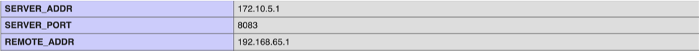
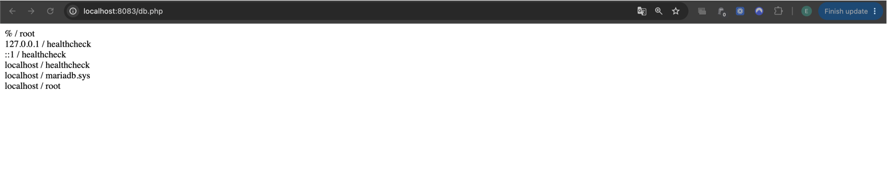

# KN04 – Docker Compose (Teil A)

## Ziel

In diesem Auftrag wurde die Web- und Datenbankumgebung aus KN02 mit Docker Compose umgesetzt. Der Webserver wird über ein Dockerfile gebaut, während die Datenbank direkt über das offizielle MariaDB-Image konfiguriert wird.

---

# Docker Compose Datei

Datei:

```text
docker-compose.yml
```

Die Docker Compose Datei erstellt:

- Container `m347-kn04a-web`
- Container `m347-kn04a-db`
- Netzwerk mit eigener Konfiguration
- Verbindung zwischen Webserver und Datenbank

---

# Dockerfile Webserver

Datei:

```text
web/Dockerfile
```

Verwendetes Basisimage:

```dockerfile
FROM php:8.0-apache
```

Zusätzlich wird die PHP-Erweiterung `mysqli` installiert, damit PHP mit MariaDB kommunizieren kann.

---

# Starten der Umgebung

## Befehl

```bash
docker compose up -d
```

---

# Erklärung von docker compose up

Der Befehl führt mehrere Docker-Befehle automatisch aus:

| Befehl | Erklärung |
|----------|----------|
| docker build | Erstellt das Webserver-Image anhand des Dockerfiles |
| docker network create | Erstellt das definierte Netzwerk |
| docker create | Erstellt die Container |
| docker start | Startet die Container |

---

# Netzwerk

Für die Kommunikation zwischen den Containern wurde folgendes Netzwerk definiert:

```yaml
subnet: 172.10.0.0/16
ip_range: 172.10.5.0/24
gateway: 172.10.5.254
```

Dadurch befinden sich Webserver und Datenbank im selben Netzwerk und können miteinander kommunizieren.

---

# Test info.php

URL:

```text
http://localhost:8083/info.php
```

Die Seite zeigt die PHP-Konfiguration sowie die Netzwerkadressen des Containers an.

## Screenshot



*Abbildung A1: Ausgabe von info.php mit sichtbaren Feldern REMOTE_ADDR und SERVER_ADDR.*

---

# Test db.php

URL:

```text
http://localhost:8083/db.php
```

Die Seite zeigt die erfolgreiche Verbindung zwischen Webserver und Datenbank.

## Screenshot



*Abbildung A2: Erfolgreiche Datenbankverbindung über db.php.*

---

# Verwendete Dateien

```text
docker-compose.yml
web/Dockerfile
web/info.php
web/db.php
```

---

# Verwendete Befehle

```bash
docker compose up -d

docker compose ps

docker compose down
```

---

# Fazit

Mit Docker Compose konnten Webserver und Datenbank automatisiert gestartet werden. Beide Container befinden sich im selben Netzwerk und können dadurch problemlos miteinander kommunizieren.