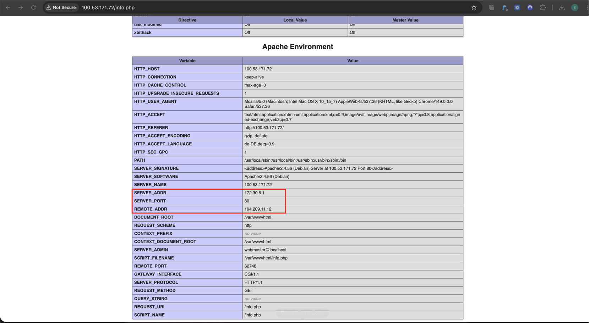
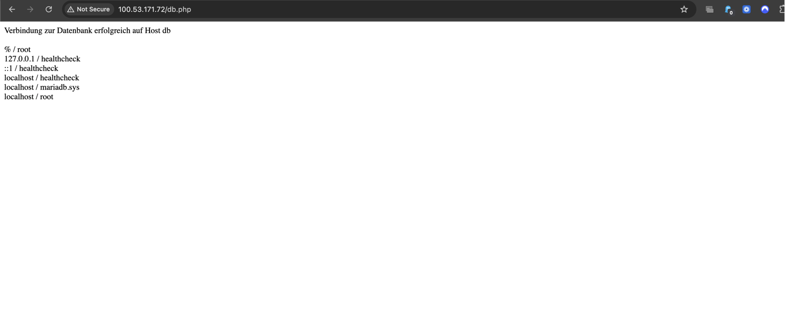

# KN04C – Docker Compose in der Cloud

## Ziel

In diesem Auftrag wurde die Docker-Compose-Lösung aus KN04A mithilfe von **Cloud-Init** automatisch auf einer AWS-VM installiert. Beim Start der Instanz wurden Docker, Docker Compose sowie alle benötigten Dateien automatisch erstellt und die Container gestartet.

---

# Cloud-Init

Für die Installation wurde eine Cloud-Init-Datei verwendet.

Diese erstellt automatisch:

- Docker
- Docker Compose
- docker-compose.yml
- Dockerfile
- info.php
- db.php

Anschliessend wird automatisch folgender Befehl ausgeführt:

```bash
docker compose up -d --build
```

Dadurch werden die Images gebaut und beide Container gestartet.

---

# Test der Anwendung

## info.php

Die Seite wurde erfolgreich über den Browser aufgerufen.

Dabei sind die Werte **REMOTE_ADDR** und **SERVER_ADDR** sichtbar, womit bestätigt wird, dass der Webserver korrekt läuft.

### Screenshot



---

## db.php

Die Datenbankverbindung wurde erfolgreich aufgebaut.

Die Webseite konnte sich mit dem MariaDB-Container verbinden und die Verbindung wurde erfolgreich getestet.

### Screenshot



---

# Ergebnis

Die komplette Anwendung wurde erfolgreich über **Cloud-Init** installiert und gestartet.

Es waren nach dem Erstellen der AWS-Instanz keine zusätzlichen manuellen Installationsschritte notwendig.

Alle Anforderungen der Aufgabe konnten erfolgreich umgesetzt werden.