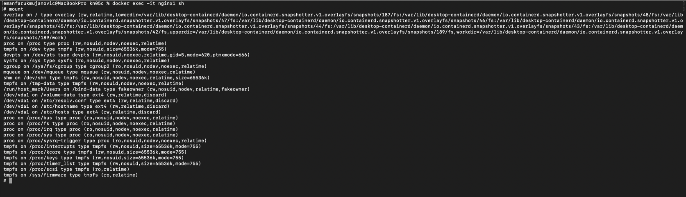
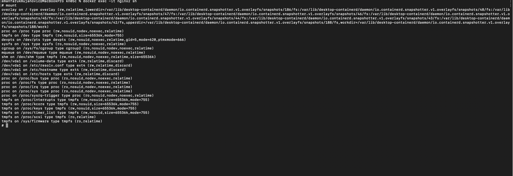

# KN05 – Arbeit mit Speicher

# Teil C – Speicher mit Docker Compose

## Ziel

In diesem Teil wurden die drei verschiedenen Docker-Speichertypen mit Docker Compose eingesetzt:

- Bind Mount
- Named Volume
- tmpfs

Zusätzlich wurden zwei nginx-Container erstellt, welche auf dieselben oder unterschiedliche Speicherbereiche zugreifen.

---

# Docker Compose Datei

Datei:

```text
docker-compose.yml
```

Verwendete Speichertypen:

| Speichertyp | Container |
|------------|------------|
| Named Volume | nginx1 und nginx2 |
| Bind Mount | nginx1 |
| tmpfs | nginx1 |

---

# Container starten

```bash
docker compose up -d
```

---

# Container 1

Container:

```text
nginx1
```

Verwendete Speicher:

- Named Volume
- Bind Mount
- tmpfs

---

# Mounts anzeigen

```bash
docker exec -it nginx1 sh
```

```bash
mount
```

---

## Screenshot



*Abbildung C1: Ausgabe des Befehls `mount` im Container nginx1. Sichtbar sind Named Volume, Bind Mount und tmpfs.*

---

# Container 2

Container:

```text
nginx2
```

Verwendeter Speicher:

- Named Volume

---

# Mounts anzeigen

```bash
docker exec -it nginx2 sh
```

```bash
mount
```

---

## Screenshot



*Abbildung C2: Ausgabe des Befehls `mount` im Container nginx2. Sichtbar ist das eingebundene Named Volume.*

---

# Verwendete Befehle

```bash
docker compose up -d

docker exec -it nginx1 sh

mount

docker exec -it nginx2 sh

mount
```

---

# Verwendete Speichertypen

## Bind Mount

Ein Ordner vom Host-System wird direkt in den Container eingebunden.

---

## Named Volume

Ein von Docker verwalteter Speicherbereich, der von mehreren Containern gemeinsam genutzt werden kann.

---

## tmpfs

Ein temporärer Speicherbereich im Arbeitsspeicher (RAM). Die Daten gehen verloren, sobald der Container gestoppt wird.

---

# Fazit

Mit Docker Compose konnten alle drei Speicherarten erfolgreich eingesetzt werden. Die Ausgabe des Befehls `mount` zeigt, dass die Speicher korrekt eingebunden wurden. Der erste Container verwendet alle drei Speichertypen, während der zweite Container auf das gemeinsame Named Volume zugreift.